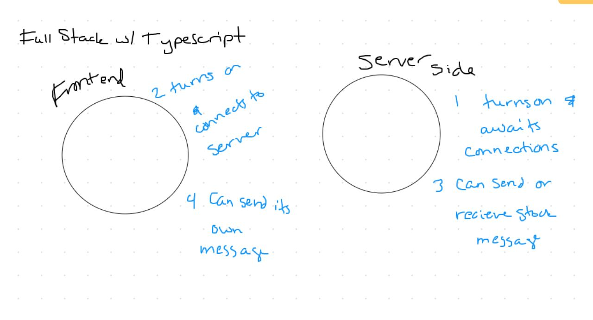

# LAB - Class 43

## Project: Full Stack with Typescript

### Author: Ashley Biermann

### Links and Resources

- [submission PR](https://github.com/401-advanced-javascript-ashley-biermann/typescript-reactfrontend/pull/2)
- [connect to back-end server url on GitHub](https://github.com/401-advanced-javascript-ashley-biermann/typescript-serverside) (while in development)

### Setup

- download and install partner server App 
- install npm packages

#### How to initialize/run your application

- `npm run dev` currently, while in development mode

#### Tests

- not yet implemented

#### What App Does

- This is a client side application built with typescript and React that can connect to a server to provide basic chat by using socket.io.

#### UML

- 
